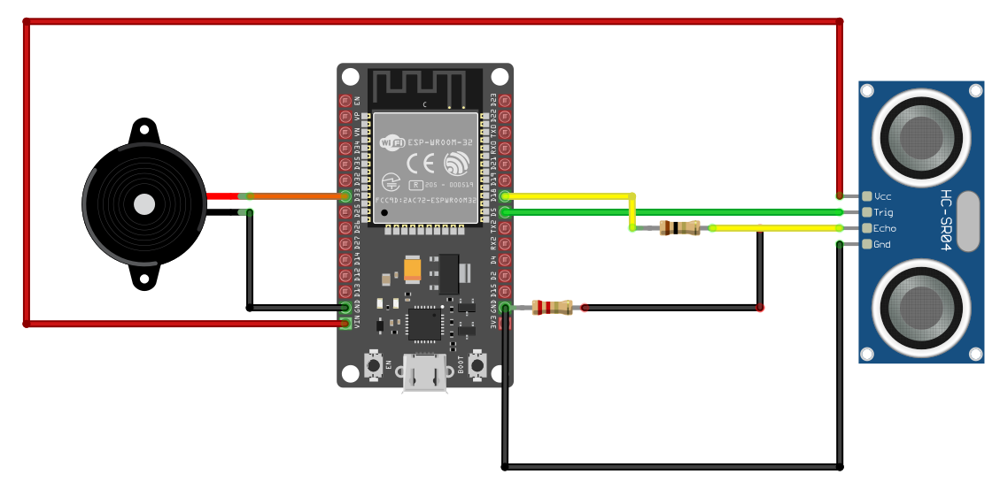

# Buzzer Alert for Object Detection with ESP32 and Ultrasonic Sensor 

In our previous exercise, we used an LED that got brighter as the object got closer to the ultrasonic sensor module. Now, instead of the LED, we'll use an active buzzer. The buzzer will make a sound as the object moves closer. While you could use PWM to create different sounds or tones, we'll keep things simple for this project. As the object gets closer to the sensor, the buzzer will produce a beep sound.

## Circuit

The circuit is almost the same as before. The only difference is that you need to remove the LED and its associated resistor. Instead, connect the buzzer to GPIO 33. We will connect the positive pin(usually marked with plus sign) of the Buzzer to the GPIO 33 and other pin to the ground. 



## Code

We will set GPIO 33 as our output pin with an initial Low state. This is the same as the LED code; the only change is the variable name. 
   
```rust
let mut buzzer = Output::new(peripherals.GPIO33, Level::Low);
```

We won't need the timer or PWM configurations we used for the LED. Instead, we will set the buzzer to High (it will make a sound when it is High) if the distance is less than 30cm; otherwise, it will remain Low.

```rust
if distance < 30.0 {
    buzzer.set_high();
} else {
    buzzer.set_low();
}
```

## Full code

```rust
#![no_std]
#![no_main]

use esp_backtrace as _;
use esp_hal::{
    delay::Delay,
    gpio::{Input, Level, Output, Pull},
    prelude::*,
    rtc_cntl::Rtc,
};

#[entry]
fn main() -> ! {
    let peripherals = esp_hal::init({
        let mut config = esp_hal::Config::default();
        config.cpu_clock = CpuClock::max();
        config
    });

    let mut buzzer = Output::new(peripherals.GPIO33, Level::Low);

    // For HC-SR04 Ultrasonic
    let mut trig = Output::new(peripherals.GPIO5, Level::Low);
    let echo = Input::new(peripherals.GPIO18, Pull::Down);

    let delay = Delay::new();
    let rtc = Rtc::new(peripherals.LPWR);

    loop {
        delay.delay_millis(5);

        // Trigger ultrasonic waves
        trig.set_low();
        delay.delay_micros(2);
        trig.set_high();
        delay.delay_micros(10);
        trig.set_low();

        // Measure the duration the signal remains high
        while echo.is_low() {}
        let time1 = rtc.current_time();
        while echo.is_high() {}
        let time2 = rtc.current_time();
        let pulse_width = match (time2 - time1).num_microseconds() {
            Some(pw) => pw as f64,
            None => continue,
        };

        // Derive distance from the pulse width
        let distance = (pulse_width * 0.0343) / 2.0;
        // esp_println::println!("Pulse Width: {}", pulse_width);
        // esp_println::println!("Distance: {}", distance);

        if distance < 30.0 {
            buzzer.set_high();
        } else {
            buzzer.set_low();
        }

        delay.delay_millis(60);
    }
}
```
