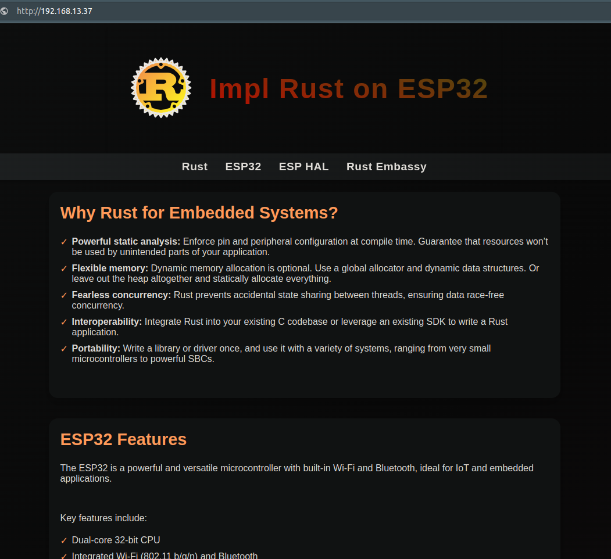
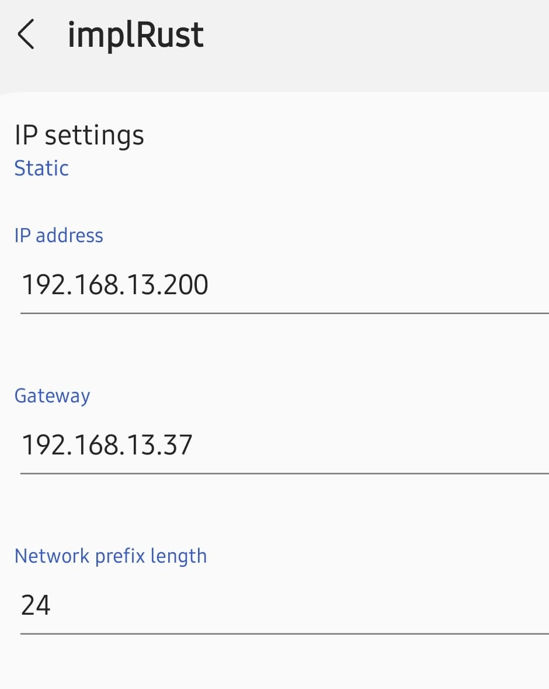
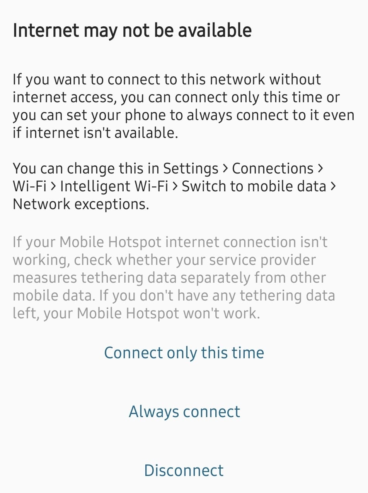

# How to run?

We need to pass the environment variables for the Wi-Fi connection. 

```sh
SSID=YOUR_WIFI_NAME PASSWORD=YOUR_WIFI_PASSWORD  cargo run --release
```

Once you flash the program onto the ESP32, wait for it to print the IP address and say web server is started. 

## Connect your system to ESP32's Wi-Fi

We are not running any DHCP server on our ESP32, so devices that connect to our Wi-Fi network won't get an IP automatically. Therefore, we need to configure a static IP address when connecting in that device. You can look up how to set a static IP address for Wi-Fi on your operating system and configure it accordingly.

Make sure your system is connected to the Wi-Fi network we created. Then, you can access the webpage by navigating to "http://192.168.13.37/" (replace with the IP address you assigned) in your browser.




## Connect your mobile to ESP32's Wi-Fi

When connecting your Android phone to the ESP32 Wi-Fi, select the Wi-Fi network, you can tap on "More details" (this may vary depending on your phone model), set a static IP, and then reconnect.



On Android, you may see an error message like "Internet may not be available" In this case, select either the "Connect only this time" or "Always Connect" option. Once connected, you can access the web server by navigating to the URL.


