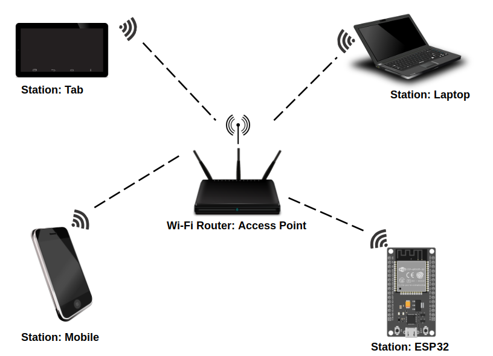
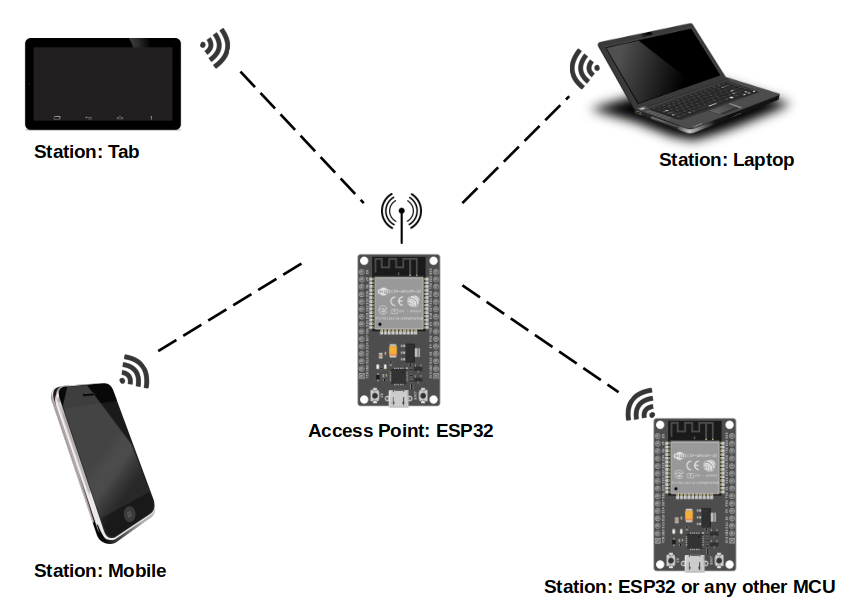

# Wi-Fi

So far, we haven't discussed one of the greatest strengths of the ESP32 chip: its Wi-Fi support. In this section, we'll explore the capabilities of ESP32's Wi-Fi and what we can achieve with it. 

The ESP32 supports standard Wi-Fi communication protocols (802.11 b/g/n) and can operate in two modes: Station (STA) mode and Soft Access Point mode.  It is also capable of running in both modes simultaneously.

## Station (STA) Mode

In this mode, the ESP32 connects to an existing Wi-Fi network as a client, similar to how your smartphone or laptop connects to a Wi-Fi router. Once connected, the ESP32 can access the internet or communicate with other devices on the same network. 

 

## Access Point (AP) Mode

In this mode, the ESP32 acts as a Wi-Fi access point, creating its own network to which other devices can connect. The ESP32 essentially functions as a router, allowing devices like smartphones, laptops, or other microcontrollers (example: ESP32) to communicate with it directly.

