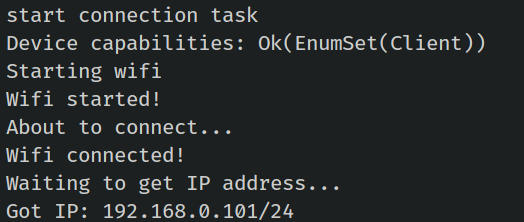

# Serve Webpage

We have completed the boilerplate for the Wi-Fi connection. Next, we will use the picoserve crate to set up a route for the root URL ("/") that will serve our HTML page.

## `impl_trait_in_assoc_type` feature
The picoserve crate requires the use of the `impl_trait_in_assoc_type` feature, which is currently an unstable feature in Rust. To enable this feature, you need to add the following line to the top of your async_main.rs file:
```rust
#![feature(impl_trait_in_assoc_type)]
```

## Application and Routing

The picoserve crate provides various traits to configure routing and other features needed for a web application. The `AppBuilder` trait is used to create a static router without state, while the `AppWithStateBuilder` trait allows for a static router with application state. Since our application only serves a single HTML page and doesn't require state, we will implement the AppBuilder trait.  You can find more examples of how to use picoserve [here](https://github.com/sammhicks/picoserve/tree/development/examples).

```rust
struct Application;

impl AppBuilder for Application {
    type PathRouter = impl routing::PathRouter;

    fn build_app(self) -> picoserve::Router<Self::PathRouter> {
        picoserve::Router::new().route(
            "/",
            routing::get_service(File::html(include_str!("index.html"))),
        )
    }
}
```

We have created a simple struct that implements the AppBuilder trait. We need to specify the PathRouter type, and we define it as any type that implements the routing::PathRouter trait.

Then, we need to implement the build_app function, which returns a Router instance. We set up a single route for "/," which serves a static HTML page. The content of the HTML page is embedded into the application at compile time using the include_str!("index.html") macro.  Place the "index.html" file in the "src/bin/" folder.


## Pool size

We need to start multiple tasks to handle incoming requests. Soon, we'll create a web_task function(an Embassy task) with a pool size set by a constant value we define now. Then, we'll launch tasks in a loop based on this value, which controls how many tasks can run concurrently.

```rust
const WEB_TASK_POOL_SIZE: usize = 2;
```

We have set the pool size to 2. In the picoserve's examples, the pool size is set to 8. You can increase the pool size, but keep in mind that you'll also need to adjust resources like sockets and memory arena accordingly.


## Launch the App
Note: This code should be placed inside the main function after setting up the Wi-Fi tasks and obtaining the IP address.

We will create an instance of the AppRouter by calling the build_app function. We need to make it static with the help of the make_static macro so that we can use it in multiple asynchronous tasks.

```rust
let app = picoserve::make_static!(AppRouter<Application>, Application.build_app());
```

We will configure the server settings with timeouts to control how long to wait before timing out on different operations. These timeouts apply when starting to read a request, waiting to read, or waiting to write the response. If any of these operations take too long, the connection will be closed.

```rust
let config = picoserve::make_static!(
    picoserve::Config<Duration>,
    picoserve::Config::new(picoserve::Timeouts {
        start_read_request: Some(Duration::from_secs(5)),
        read_request: Some(Duration::from_secs(1)),
        write: Some(Duration::from_secs(1)),
    })
    .keep_connection_alive()
);
```

This is straightforward logic. We launch multiple tasks to handle incoming requests based on the pool size we set earlier. For each task, we pass the task id (iteration number), app instance, network stack instance, and server settings.

```rust
for id in 0..WEB_TASK_POOL_SIZE {
    spawner.must_spawn(web_task(id, *stack, app, config));
}
```

## Web Task function

We have created an Embassy task and specified the pool size in the attribute. The web server will listen on port 80. For each task, we define the TCP read and write buffers, along with the HTTP buffer. Finally, we call the listen_and_serve function from picoserve to handle incoming requests.

```rust
#[embassy_executor::task(pool_size = WEB_TASK_POOL_SIZE)]
async fn web_task(
    id: usize,
    stack: Stack<'static>,
    app: &'static AppRouter<Application>,
    config: &'static picoserve::Config<Duration>,
) -> ! {
    let port = 80;
    let mut tcp_rx_buffer = [0; 1024];
    let mut tcp_tx_buffer = [0; 1024];
    let mut http_buffer = [0; 2048];

    picoserve::listen_and_serve(
        id,
        app,
        config,
        stack,
        port,
        &mut tcp_rx_buffer,
        &mut tcp_tx_buffer,
        &mut http_buffer,
    )
    .await
}
```


## Clone the existing project
You can also clone (or refer) project I created and navigate to the `webserver-html` folder.

```sh
git clone https://github.com/ImplFerris/esp32-projects
cd esp32-projects/webserver-html
```

### How to run?

For this example also, we need to pass the environment variables for the Wi-Fi connection. You can either create a .env file or pass them directly, as I am doing here.

```sh
SSID=YOUR_WIFI_NAME PASSWORD=YOUR_WIFI_PASSWORD  cargo run --release
```

Once you flash the program onto the ESP32, you should see the following output in your console with the IP address assigned by your Wi-Fi router.



Make sure your system is connected to the same Wi-Fi network.  You can then access the webpage by navigating to "http://192.168.0.101/" (replace with the IP address you received) in your browser. 


